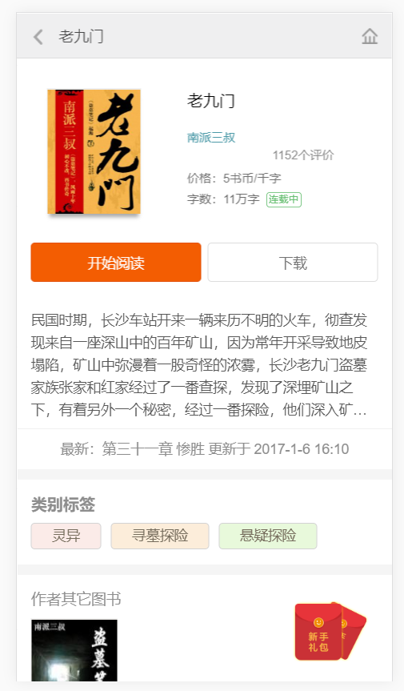
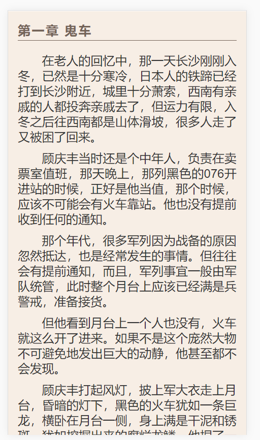
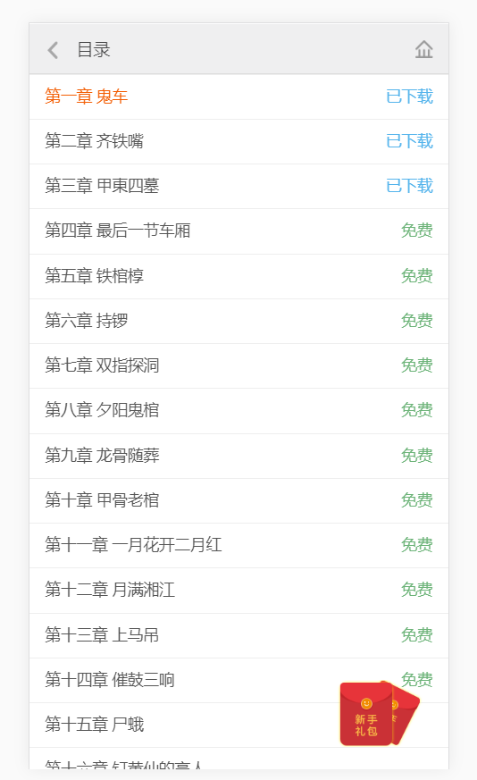
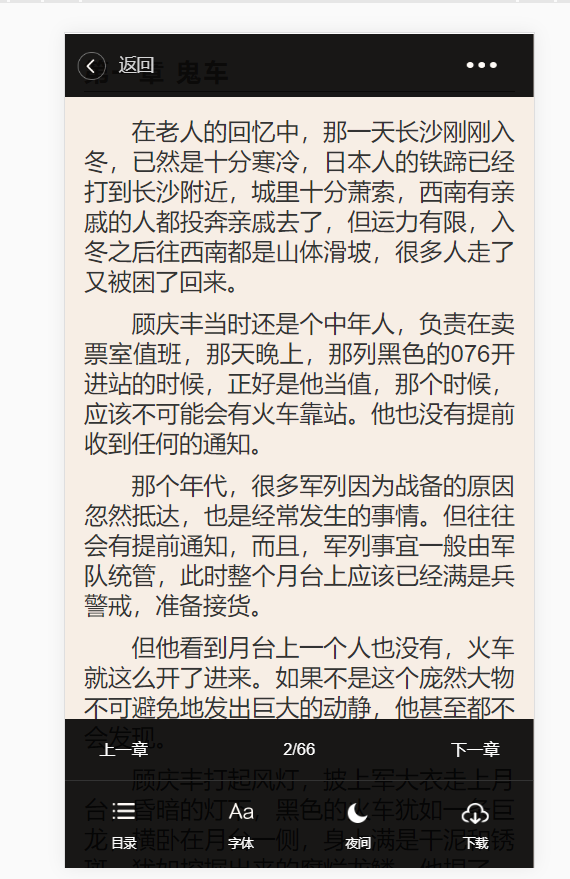

# book-city
>项目介绍
```
读书在小米 创作无极限 —— 这个口号一直是起点众多玄幻、魔幻、武侠、军文小说作者的创作目标，严谨的写作态度，锲而不舍的求新求变，与书友的直接沟通交流修改，从而起点中文网拥有国内很多具有一流水平的原创作品，使书友得以在第一时间阅读到作者连载的好书佳作。
```
>技术栈
```
gulp + require + handlebars + ajax + sass + flex
```

>项目运行
```
```

>目录结构
```
    book-city
    |--mock
    |   |--index
    |   |   |---352876.json
            |---home.json
            |---login.json
            |---recommend1.json
            |---recommend2.json
            |---recommend3.json
    |   |--render
        |   |---chapter-list.json//目录
        |   |---data1.json        
        |   |---data2.json
        |   |---data3.json
        |   |---data4.json
        |--search
        |   |---search.json
        |   |---searchKey.json
        |---index.js //数据接口
    |--src
    |   |--dest
    |   |--fonts2
    |   |--img
    |   |--js
    |   |--page
    |   |--scss
    |   |--template
    |   |--index.html
```
>项目截图
```





```